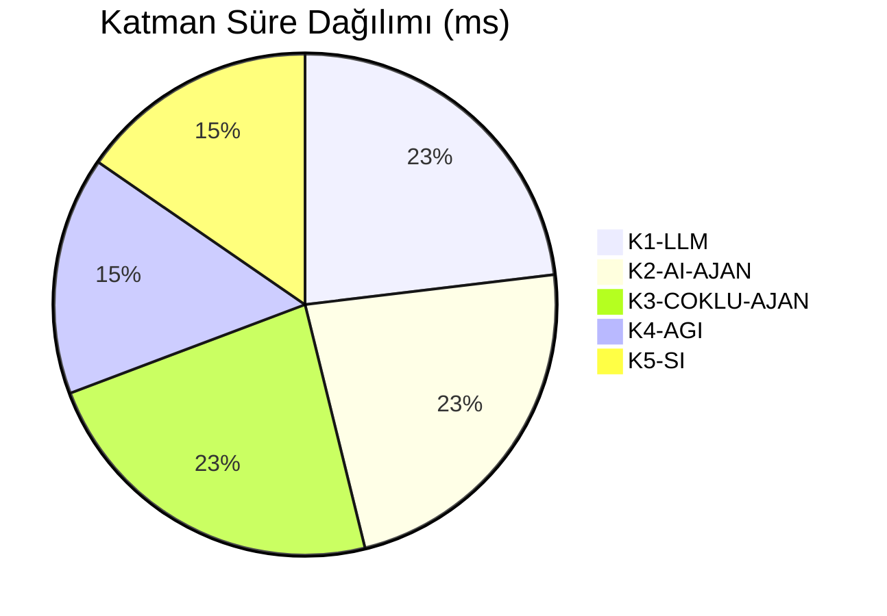
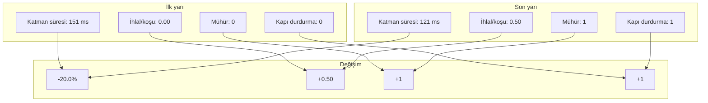
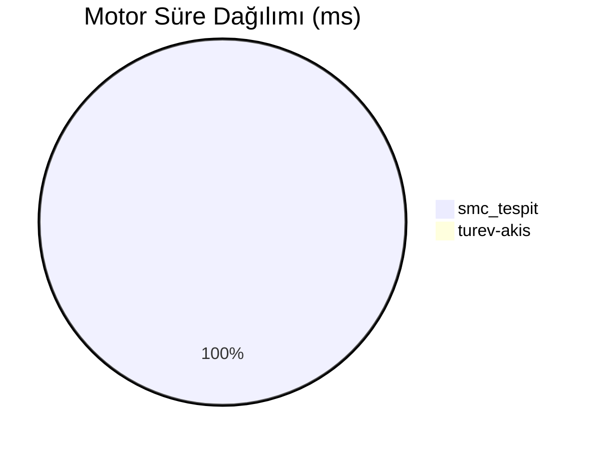

# Piramit Boru Hattı İzleme Raporu
## 2026-07-28T23:33:25Z - 2026-07-28T23:33:25Z

> **Not**: Bu rapor `izleme-telemetri` becerisinin yerel JSONL ölçümlerinden üretildi (`/home/user/Future-/.claude/skills/izleme-telemetri/ornek/olcum_ornek.jsonl`, 72 veri noktası). OTel/Prometheus/Grafana bu ortamda KURULU DEĞİLDİR; dış yığın opsiyoneldir (`sunucu/`). Her sayı dosyadan okunmuştur.

## Yönetici Özeti

Bu dönemde **3 piramit koşusu** ölçüldü; **1** koşu bir katman kapısında durdu, **1** koşu gözlemci kritik ihlaliyle **mühürlendi** (işlem yok). Danışman doğrulama oranı **%33** (2/6). Toplam katman süresi **392 ms**, koşu başına ortalama **134 ms**.

Emir çıktısı: **2** koşuda emir üretildi, **1** koşuda "EMİR YOK". Determinizm: **0** tekrar gözlemi aynı, **1** kırık (2 ilk gözlem kıyaslanmadı).

## Kullanım Metrikleri

### Anahtar Metrikler

- **Koşu Sayısı**: 3 (BTCUSDT: 2, ETHUSDT: 1)
- **Ortalama Koşu Süresi**: 134 ms (p50 154 ms, p95 154 ms)
- **Danışman Doğrulama Oranı**: %33
  - gorsel-teyit: %0 (0/2)
  - grafik-calisma: %0 (0/2)
  - karar-motoru: %100 (2/2)
- **Gözlemci İhlali**: 1 (kritik 1), **Uyarı**: 3
- **Zorunlu Girdi Eksiği**: 6

## Katman ve Kapı Dökümü

Boru hattının kendi artefaktından (piramit raporu) okunan kapı ve danışman kayıtları:

### Kapı Durumu

| Katman | GEÇTİ | DURDU | Son durdurma gerekçesi |
|---|---|---|---|
| K1-LLM | 3 | 0 | — |
| K2-AI-AJAN | 3 | 0 | — |
| K3-COKLU-AJAN | 2 | 1 | K3-COKLU-AJAN kapısı KAPALI: yetersiz kanıt |
| K4-AGI | 2 | 0 | — |
| K5-SI | 2 | 0 | — |

### Doğrulanmayan Danışmanlar

| Danışman | Doğrulandı | Doğrulanmadı | Oran |
|---|---|---|---|
| gorsel-teyit | 0 | 2 | %0 |
| grafik-calisma | 0 | 2 | %0 |
| karar-motoru | 2 | 0 | %100 |

### Gözlemci İhlalleri

| Kod | Adet | Kritik mi | En sık katman |
|---|---|---|---|
| UYDURMA | 1 | EVET (mühür) | K3-COKLU-AJAN |

Uyarılar (mühür sebebi değil): `TUNEL`×3

### Katman Süre Eğilimi

| Katman | Koşu | Ortalama | p95 | En uzun | Toplam |
|---|---|---|---|---|---|
| K1-LLM | 3 | 30 ms | 30 ms | 30 ms | 90 ms |
| K2-AI-AJAN | 3 | 30 ms | 30 ms | 30 ms | 90 ms |
| K3-COKLU-AJAN | 3 | 30 ms | 30 ms | 30 ms | 91 ms |
| K4-AGI | 2 | 30 ms | 30 ms | 30 ms | 60 ms |
| K5-SI | 2 | 30 ms | 30 ms | 30 ms | 60 ms |

### Boru Hattı Sağlığı Kıyası

*Kıyas 1 + 2 koşu üzerinden; ölçüm penceresi kısaysa eğilim YORUMDUR, kanıt değildir.*

### Koşu Dökümü

| Koşu | Sembol | Katman süresi | İhlal | Mühür | Durduğu kapı | Türev kapsamı | Emir |
|---|---|---|---|---|---|---|---|
| 212aaaf76501 | BTCUSDT | 151 ms | 0 | hayır | — | 1.00 | LIMIT LONG @100.0 \| 98.0 \| 104.0 \| R=2.00 |
| c414ffe66394 | BTCUSDT | 151 ms | 1 | EVET | — | 0.55 | EMİR YOK — DENETİM MÜHÜRÜ |
| 9157a6959c1d | ETHUSDT | 90 ms | 0 | hayır | K3-COKLU-AJAN | 0.40 | LIMIT LONG @100.0 \| 98.0 \| 104.0 \| R=2.00 |

## Süre Analizi

*Kaynak rehberin "Cost Analysis" bölümünün karşılığı: bu depoda harcanan kaynak para/token değil, **koşu süresidir** (USD metriği VERİ YOK — bkz. KANIT.md/SAPMALAR).*

- **Toplam Katman Süresi**: 392 ms
- **Toplam Motor Süresi (sarmalanan)**: 6 ms
- **Koşu Başına Süre**: 134 ms
- **Türev Kapsamı**: ortalama 0.65, en düşük 0.40, en yüksek 1.00 (n=3)
- **Kapsam Dağılımı**: 0.25–0.50: 1, 0.50–0.75: 1, 0.75–1.00: 1
- **Determinizm**: 0 aynı / 1 kırık / 2 ilk gözlem

| Koşu | Veri imzası | Önceki sonuç | Yeni sonuç |
|---|---|---|---|
| c414ffe66394 | 2a1a935fc626a01b | f0e47b77fb8f5edd | e10f3112cf69a9f4 |

## Uygulanabilir İçgörüler

1. **Kronik kapı `K3-COKLU-AJAN`**: 3 koşunun 1'inde (%33) boru hattı burada durdu — gerekçe: K3-COKLU-AJAN kapısı KAPALI: yetersiz kanıt
2. **`gorsel-teyit` danışmanı zayıf doğrulanıyor**: 2 koşuda doğrulama oranı %0 (kural: < %50). Bu danışmanın kanıtı sentezde ağırlık kaybediyor.
3. **`grafik-calisma` danışmanı zayıf doğrulanıyor**: 2 koşuda doğrulama oranı %0 (kural: < %50). Bu danışmanın kanıtı sentezde ağırlık kaybediyor.
4. **En sık gözlemci ihlali `UYDURMA`**: 1 kez (KRİTİK — mühür sebebi). Toplam mühürlenen koşu: 1.
5. **Zorunlu girdi `likidasyon` en sık eksik**: 3 kez. Kapsam bu yüzden 1.00'e çıkamıyor; karar eksik kanalla veriliyor.
6. **Türev kapsamı ortalama 0.65** (hedef 1.00); 1 koşu turev-akis'in kendi fail-closed eşiğinin (0.5) altında kaldı → danışman doğrulanmamış sayıldı.
7. **Determinizm KIRIK**: 1 kez aynı veri imzası farklı sonuç imzası üretti. Bu bir motor/hafıza sızıntısı işaretidir; kıyas ve akıbet ölçümü güvenilmez hale gelir.
8. **En çok sonuç üretemeyen motor `turev-akis`**: 6 kez (K2 hata kaydı + sarmalanan istisna).

## Öneriler

1. Zorunlu girdi toplama akışını sıkılaştır (`likidasyon`×3, `görsel okuma`×3) — CoinGlass likidasyon ve görsel okuma damgalı gelmeden koşu başlatma; bayat okuma yeni kline ile birleştirilmiyor (fail-closed).
2. `K3-COKLU-AJAN` kapısında duran koşular için girdi eksiğini koşudan ÖNCE denetle; kapı gevşetilmez (yanlış-pozitifin maliyeti asimetrik), girdi tamamlanır.
3. Determinizm kırılan koşuları (aşağıdaki imza tablosu) tekrar koştur; fark motor sürümünden mi, hafıza/ağırlık dosyasından mı geliyor ayrıştır.
4. Sonuç üretemeyen motorları K2 kapısı öncesinde raporla — motor sayısı `min_motor_k2` altına düşerse koşu boşa gider.
5. En pahalı motor `smc_tespit` (6 ms); ölçüm sarmalamasını bu motorun alt adımlarına indir ki darboğaz alt-fonksiyon seviyesinde görünsün.

## Koşu Süresi Dağılımı

| Aralık | Koşu | Sıklık |
|---|---|---|
| < 0.5 sn | 3 | ███ |
| 0.5–1 sn | 0 | — |
| 1–2.5 sn | 0 | — |
| 2.5–5 sn | 0 | — |
| 5–10 sn | 0 | — |
| 10+ sn | 0 | — |

*Kaynak seri: piramit.kosu.sure_ms (n=3); p50 154 ms, p95 154 ms, en uzun 154 ms.*

### Varsayımlar / eşik kaynağı

- `katman_pay` = 0.5 — ETİKETLİ KONVANSİYON (kalibre edilmiş piyasa eşiği DEĞİL; içgörü kuralı sınırıdır)
- `kapi_durdurma_orani` = 0.25 — ETİKETLİ KONVANSİYON (kalibre edilmiş piyasa eşiği DEĞİL; içgörü kuralı sınırıdır)
- `dogrulama_orani` = 0.5 — ETİKETLİ KONVANSİYON (kalibre edilmiş piyasa eşiği DEĞİL; içgörü kuralı sınırıdır)
- `kapsam_tam` = 1.0 — ETİKETLİ KONVANSİYON (kalibre edilmiş piyasa eşiği DEĞİL; içgörü kuralı sınırıdır)
- `kapsam_esigi` = 0.5 — ETİKETLİ KONVANSİYON (kalibre edilmiş piyasa eşiği DEĞİL; içgörü kuralı sınırıdır)

---

*Bu rapor `izleme-telemetri/scripts/rapor.py` tarafından yerel JSONL ölçümünden otomatik üretildi. Gerçek = dosyadan okunan sayı; yorum = eşik kuralıyla türetilen içgörü; eksik = VERİ YOK.*
